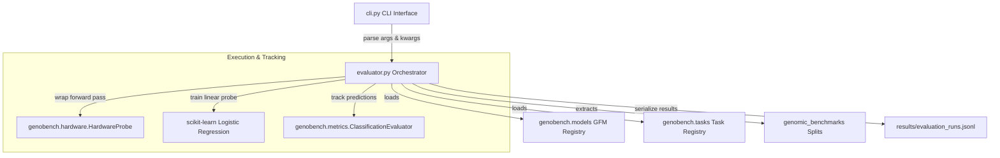

# System Architecture Overview

GenoBench is designed around a modular, plugin-based architecture using the **registry design pattern**. This decoupled structure ensures that new models, tasks, hardware probes, and biological metrics can be introduced independently.

---

## Conceptual Architecture



---

## Core Architecture Components

### 1. Dynamic Registry Pattern
GenoBench uses central registries to decouple pipeline orchestration from concrete model and task implementations:
*   [models/__init__.py](../genobench/models/__init__.py) defines `MODEL_REGISTRY` and `@register_model`.
*   [tasks/__init__.py](../genobench/tasks/__init__.py) defines `TASK_REGISTRY` and `@register_task`.

Any model or task module registered with these decorators is loaded dynamically at runtime via `get_model(name)` or `get_task(name)`.

### 2. GFM Abstraction (`BaseGFM`)
All models must implement the `BaseGFM` interface defined in [base.py](../genobench/models/base.py). The evaluator interacts only with this abstract interface:
```python
class BaseGFM:
    def get_embeddings(self, texts: List[str], batch_size: int = 16, probe: Optional[any] = None) -> np.ndarray:
        """Extract mean-pooled sequence representations of shape (len(texts), hidden_dim) on CPU."""
        raise NotImplementedError
```
This abstraction keeps tokenizer configuration, model weights caching, batch collation, and model-specific forward-pass logic hidden inside the model wrappers.

### 3. Pipeline Orchestrator (`evaluator.py`)
The [evaluator.py](../genobench/evaluator.py) orchestrator coordinates the end-to-end linear probing run:
1.  **Retrieve Splits**: Loads training and testing data splits from the selected task.
2.  **Dataset Shuffling**: Shuffles train and test samples using a fixed seed (`numpy.random.default_rng(42)`) to ensure balanced distribution when slicing datasets for fast benchmarking.
3.  **Warmup**: Runs a single batch forward pass to compile Triton custom layers and load GPU/tokenizer caches.
4.  **Embedding Extraction**: Extracts representations for training.
5.  **Hardware Profiling**: Wraps test embedding extraction in the `HardwareProbe` context manager to capture peak memory and latency.
6.  **Linear Probing**: Trains a scikit-learn `LogisticRegression(class_weight="balanced")` probe on the frozen training representations.
7.  **Evaluation & Serialization**: Generates predictions on the test split, computes MCC and AUPRC, collects environment configurations, and saves the output.
